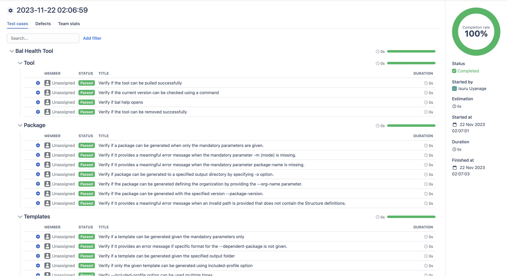

# Running Bal Health Tool Tests

## Prerequisites
1. Install [Ballerina](https://ballerina.io/downloads/) 2201.8.2 (Swan Lake Update 8)

2. Install [jq](https://jqlang.github.io/jq/download/)

## Run the tests
To run all the tests you can run the run.sh file. Before that you need to obtain the access token in Qase (Test Manageent tool) as this script finally writes the test results to Qase. 

To run all the tests, execute the following command. 
```
./run.sh <QASE API TOKEN>
```
Once you run all the tests, to view the test report, you can login to [Qase](https://app.qase.io/project/OHOC), click on Test Runs. You will be able to see a test run is created and the results are published. The test report can be shared. 



To run the tool related tests only, run the following script. 
```
./tool-tests.sh
```

To run the package related tests only, run the following script. 
```
./package-tests.sh
```

To run the templates related tests only, run the following script. 
```
./template-tests.sh
```

Before running the package and the tool tests, make sure that you have installed the Bal Health Tool. 
